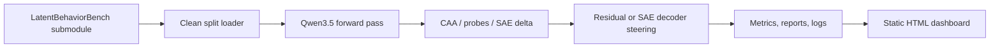

# Steering Research

This repository is a reproducible experiment harness for studying latent
behavioral features in Qwen3.5 models with LatentBehaviorBench and Qwen-Scope
sparse autoencoders.

!!! warning "Research status"

    The repository provides an experiment harness, artifact discipline, and
    reproducible evaluation path. Strong safety, OOD, or capability-preservation
    claims still require held-out evaluation, controls, and manual review of
    benchmark-specific caveats.

## What the repository does

The codebase implements the complete path from benchmark records to activation
directions, sparse feature deltas, steering interventions, run artifacts, and
static dashboards:



## Model targets

Configured model targets include:

- `Qwen/Qwen3.5-2B-Base` for workstation development;
- `Qwen/Qwen3.5-9B-Base` for H200 runs;
- `Qwen/Qwen3.5-27B` for larger H200 runs.

Each target must use its matching Qwen-Scope SAE:

- `Qwen/SAE-Res-Qwen3.5-2B-Base-W32K-L0_50`
- `Qwen/SAE-Res-Qwen3.5-9B-Base-W64K-L0_50`
- `Qwen/SAE-Res-Qwen3.5-27B-W80K-L0_50`

Common assumptions:

- Hook point: residual stream
- SAE format: `layer{n}.sae.pt` with `W_enc`, `W_dec`, `b_enc`, `b_dec`

## Core commands

```bash
uv sync --extra dev --extra model --extra training --extra docs
uv run steering validate-data
uv run ruff format --check
uv run ruff check
uv run ty check
uv run pytest
uv run zensical build --clean --strict
```

Run artifact verification after experiments complete:

```bash
uv run steering verify-runs --runs-root runs
```

## Experiment set

| ID | Name | Mode | Purpose |
| --- | --- | --- | --- |
| E001 | Mean direction | training-free | CAA behavior direction maps |
| E002 | Activation monitor | training-free | AUROC detector over projections |
| E003 | SAE delta | training-free | Qwen-Scope feature ranking |
| E004 | CAA steering | training-free | Residual steering dose response |
| E005 | SAE feature steering | training-free | Decoder-vector steering |
| E006 | LoRA SFT | training | Good-side contrast supervised training |
