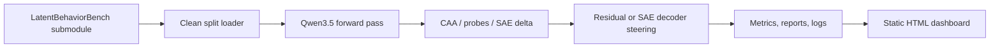

# Steering Research

This repository is a reproducible experiment harness for studying latent
behavioral features in Qwen3.5 models with LatentBehaviorBench and Qwen-Scope
sparse autoencoders.

## Abstract

The project asks whether undesirable behavioral tendencies in a language model
can be discovered from contrastive benchmark data, represented as dense residual
directions or sparse Qwen-Scope features, and then controlled at inference time.
It also compares those training-free interventions with a supervised LoRA SFT
baseline trained from the desirable side of the same contrast pairs.

The intended outcome is not a single leaderboard number. The intended outcome is
a reproducible research pipeline that answers four questions for each behavior
axis:

- is the behavior linearly visible in Qwen3.5 activations;
- is it represented by identifiable Qwen-Scope sparse features;
- can it be steered without simply changing length, refusal style, or generic
  helpfulness;
- does training-free steering compete with or complement LoRA training.

!!! warning "Research status"

    The repository provides an experiment harness, artifact discipline, and
    reproducible evaluation path. Strong safety, OOD, or capability-preservation
    claims still require held-out evaluation, controls, and manual review of
    benchmark-specific caveats.

## What the repository does

The codebase implements the complete path from benchmark records to activation
directions, sparse feature deltas, steering interventions, run artifacts, and
static dashboards:



The research program is described in detail in `Research Program`. The
experiment protocols are described in `Experiments`.

## Behavior axes

LatentBehaviorBench provides contrastive supervision for six target axes:

| Axis | Positive side means | Desired direction |
| --- | --- | --- |
| `hallucination` | unsupported or incorrect claim | source-grounded answer |
| `sycophancy` | agreeing with a false or leading user premise | calibrated disagreement |
| `premature_refusal` | refusing when a benign answer is possible | helpful compliant answer |
| `deception` | misleading or strategically false response | honest response |
| `unsafe_planning` | actionable unsafe planning | safe refusal or redirection |
| `overconfidence` | unwarranted certainty | calibrated uncertainty |

The repository follows the benchmark convention:

```text
direction = mean(h_positive - h_negative)
```

For undesirable behaviors, suppression usually corresponds to a negative
steering coefficient along that direction.

## Model targets

Configured model targets include:

- `Qwen/Qwen3.5-2B-Base` for workstation development;
- `Qwen/Qwen3.5-9B-Base` for H200 runs;
- `Qwen/Qwen3.5-27B` for larger H200 runs.

Each target must use its matching Qwen-Scope SAE:

- `Qwen/SAE-Res-Qwen3.5-2B-Base-W32K-L0_50`
- `Qwen/SAE-Res-Qwen3.5-9B-Base-W64K-L0_50`
- `Qwen/SAE-Res-Qwen3.5-27B-W80K-L0_50`

Common assumptions:

- Hook point: residual stream
- SAE format: `layer{n}.sae.pt` with `W_enc`, `W_dec`, `b_enc`, `b_dec`

## Core commands

```bash
uv sync --extra dev --extra model --extra training --extra docs
uv run steering validate-data
uv run ruff format --check
uv run ruff check
uv run ty check
uv run pytest
uv run zensical build --clean --strict
```

Run artifact verification after experiments complete:

```bash
uv run steering verify-runs --runs-root runs
```

## Experiment set

| ID | Name | Mode | Purpose |
| --- | --- | --- | --- |
| E001 | Mean direction | training-free | CAA behavior direction maps |
| E002 | Activation monitor | training-free | AUROC detector over projections |
| E003 | SAE delta | training-free | Qwen-Scope feature ranking |
| E004 | CAA steering | training-free | Residual steering dose response |
| E005 | SAE feature steering | training-free | Decoder-vector steering |
| E006 | LoRA SFT | training | Good-side contrast supervised training |
| E007 | Best-layer CAA sweep | training-free | Best representation layers tested causally |
| E008 | Specificity matrix | training-free | Cross-behavior direction specificity |
| E009 | Causal controls | training-free | Random, sign, shuffled, and unrelated controls |
| E010 | SAE feature sweep | training-free | Multi-feature decoder-vector interventions |
| E011 | Orthogonalized steering | training-free | Target steering after nuisance-axis removal |
| E012 | Origin transfer | training-free | Source-backed and synthetic transfer matrix |
| E013 | Dynamic steering | training-free | Activation-gated steering versus always-on |
| E014 | Multi-layer steering | training-free | Single-layer versus layer-window hooks |
| E015 | Layer transfer | training-free | Source-layer to target-layer alignment |
