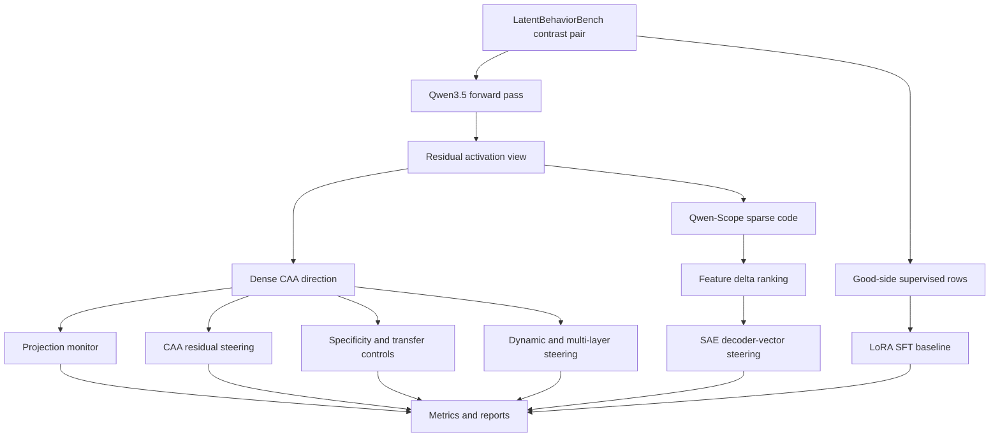

# Research Program

## Abstract

This project studies whether undesirable latent behaviors in Qwen3.5 models can
be located, measured, and controlled through representation-level interventions.
The benchmark substrate is LatentBehaviorBench, which provides paired examples
for behavior axes such as hallucination, sycophancy, premature refusal,
deception, unsafe planning, and overconfidence. The model substrate is Qwen3.5,
and the interpretability substrate is Qwen-Scope sparse autoencoders over the
residual stream.

The central research question is practical:

```text
Can we discover behavior-relevant latent directions or sparse features from
contrastive benchmark data, steer those features at inference time, and compare
training-free steering against supervised LoRA training under a common held-out
evaluation protocol?
```

The repository implements the full experimental loop: benchmark loading,
contrast-pair extraction, activation capture, dense mean-difference directions,
activation monitors, Qwen-Scope sparse feature ranking, residual steering,
SAE decoder-vector steering, LoRA SFT baselines, structured logs, JSON metrics,
Markdown reports, and static HTML dashboards.

## Motivation

Many model behaviors are not cleanly tied to a single prompt token, instruction,
or output phrase. A model can hallucinate, agree with a false user premise,
refuse prematurely, plan unsafe actions, or express unwarranted confidence
through distributed internal states. If these behaviors have stable
representation signatures, then we should be able to:

- detect them before or during generation;
- identify dense directions that separate undesirable and desirable examples;
- identify sparse Qwen-Scope features that track the same behavior;
- intervene at selected residual stream layers;
- compare inference-time control with parameter training.

This is useful because training-free steering is fast to iterate, reversible,
and easier to ablate than full fine-tuning. LoRA SFT remains a necessary
baseline because it tests whether direct parameter updates solve the same
behavior more effectively or more robustly.

## Research Questions

| Question | Experiment path |
| --- | --- |
| Are behavior axes linearly visible in residual activations? | E001, E002 |
| Which layer and activation view carry the strongest signal? | E001, E002 |
| Do Qwen-Scope sparse features align with benchmark behavior contrasts? | E003 |
| Does dense CAA steering move generated behavior in the intended direction? | E004 |
| Does sparse SAE decoder-vector steering produce a cleaner intervention? | E005 |
| How does training-free steering compare with LoRA SFT on the same data? | E006 |
| Do best diagnostic layers remain causal under generation? | E007 |
| Are directions specific to one behavior or shared across axes? | E008 |
| Do steering effects survive sign, random, shuffled, and unrelated controls? | E009 |
| Which sparse features are causal rather than only diagnostic? | E010 |
| Can nuisance behavior axes be removed from a steering direction? | E011 |
| Are effects stable across source-backed and synthetic contrast origins? | E001-E006, E012 |
| Can steering be gated by a monitor instead of applied to every prompt? | E013 |
| Does multi-layer intervention outperform a single hook? | E014 |
| Is behavior separation stable across residual stream layers? | E015 |
| Does steering change model preference between paired desirable and undesirable answers? | E016 |
| Are raw alpha schedules comparable across behaviors and layers? | E017 |
| Which token positions carry the causal intervention effect? | E018 |
| Do gains survive held-out evaluation and control buckets? | E004-E018 |

## Data Substrate

LatentBehaviorBench is used as a contrastive behavioral dataset. Each behavior
axis has examples where the positive side means the undesirable behavior is
present and the negative side means the undesirable behavior is absent,
corrected, calibrated, or safely refused.

The repository treats the benchmark as two separate resources:

- extraction data for discovering directions and features;
- held-out data for measuring whether the discovered intervention transfers.

Source-backed and synthetic origins are tracked separately. Source-backed
contrasts are preferred for primary claims because they are grounded in external
reference material. Synthetic contrasts are useful for coverage, stress tests,
and diagnostics, but they should not be mixed into source-backed evidence
without being reported separately.

## Model Substrate

The default model family is Qwen3.5:

| Scale | Use | Model config |
| --- | --- | --- |
| 2B | workstation development and rapid iteration | `configs/models/qwen35_2b.yaml` |
| 9B | primary H200 experiment target | `configs/models/qwen35_9b_h200_offline.yaml` |
| 27B | larger-scale H200 target | `configs/models/qwen35_27b.yaml` |

Each base model must be paired with the matching Qwen-Scope SAE. Mixing a model
with an SAE trained on a different base model or scale invalidates the sparse
feature interpretation.

## Methodological Thesis

The project is organized around a simple sequence:



The dense path asks whether the behavior is linearly accessible in the residual
stream. The sparse path asks whether Qwen-Scope provides a feature-level
decomposition of the same signal. The training path asks whether supervised
parameter updates outperform training-free interventions when evaluated on the
same held-out buckets.

## Success Criteria

A strong result is not just a high score in one table. A convincing result
should satisfy multiple constraints:

- E001 shows stable separation above random baseline across held-out contrast
  pairs.
- E002 shows high AUROC and a positive score gap on individual examples.
- E003 identifies sparse features with large signed deltas that are stable
  across layers, origins, or resamples.
- E004 produces a monotonic dose-response curve under alpha sweeps.
- E005 produces a similar or cleaner behavior shift using SAE decoder vectors.
- E006 improves the target behavior without damaging capability controls,
  safety controls, or unrelated behavior axes.
- E007 confirms that representation-selected layers remain causal during
  generation.
- E008 shows a strong diagonal and interpretable off-diagonal structure rather
  than uncontrolled generic behavior separation.
- E009 shows intended steering effects stronger than random, sign-flipped,
  shuffled-label, and unrelated-behavior controls.
- E010 identifies sparse features whose decoder vectors cause target movement,
  not just high contrast deltas.
- E011 either reduces side effects through orthogonalization or clearly shows
  that nuisance axes do not explain the target direction.
- E012 establishes which behavior directions transfer between source-backed and
  synthetic origins.
- E013 demonstrates that monitor-gated steering fires on an appropriate subset
  and reduces unnecessary intervention.
- E014 determines whether single-layer or multi-layer hooks are the right
  default intervention.
- E015 maps which layers preserve the behavior direction and which layers are
  layer-local artifacts.
- E016 shows a positive forced-choice margin shift toward the desirable answer
  under steering.
- E017 shows that calibrated alpha schedules preserve the useful effect while
  avoiding layer-scale artifacts.
- E018 localizes whether steering should affect prompt states, answer states,
  boundary tokens, or all positions.
- Reports keep source-backed and synthetic evidence separate.
- All runs produce complete `manifest.json`, `metrics.jsonl`, `summary.json`,
  `report.md`, `run.log`, and dashboard artifacts.

## Failure Modes

The experiments are designed to expose failure, not hide it. Important failure
modes include:

- a direction separates extraction pairs but fails held-out buckets;
- a monitor has high apparent AUROC because of answer length or formatting;
- steering changes verbosity, refusal rate, or style without changing the
  target behavior;
- sparse features are unstable across nearby layers or resamples;
- LoRA memorizes benchmark phrasing and fails controls;
- specificity matrices show that a claimed behavior direction is really a
  generic "bad answer" or "conflict" direction;
- causal controls move the metric as much as the intended intervention;
- monitor-gated steering never fires or fires on nearly every prompt;
- multi-layer hooks amplify degeneration rather than behavior movement;
- forced-choice margins move opposite to the claimed suppression direction;
- calibrated alpha removes an apparent raw-alpha effect;
- position-specific steering shows the effect comes from generic prompt
  perturbation rather than answer-relevant states;
- source-backed and synthetic evidence disagree;
- effects appear only at one alpha and do not form a dose-response curve.

These failures are still useful: they identify where the latent behavior is not
cleanly represented, where evaluation is too weak, or where an intervention is
not behavior-specific enough.

## Output of a Campaign

A complete campaign should produce:

- per-experiment run directories under a named output root;
- one static `dashboard.html` for the campaign;
- machine-readable JSON summaries for aggregation;
- JSONL metrics for notebooks, DuckDB, or downstream analysis;
- Markdown reports suitable for manual inspection;
- saved LoRA adapters for E006;
- specificity, origin-transfer, and layer-transfer matrices for E008, E012, and
  E015;
- control-run aggregates for E009 and orthogonalization comparisons for E011;
- generation tables for all steering experiments E004, E005, E007, E009, E010,
  E011, E013, and E014;
- a written interpretation of which behavior axes are steerable, which are only
  detectable, and which require a different method.
